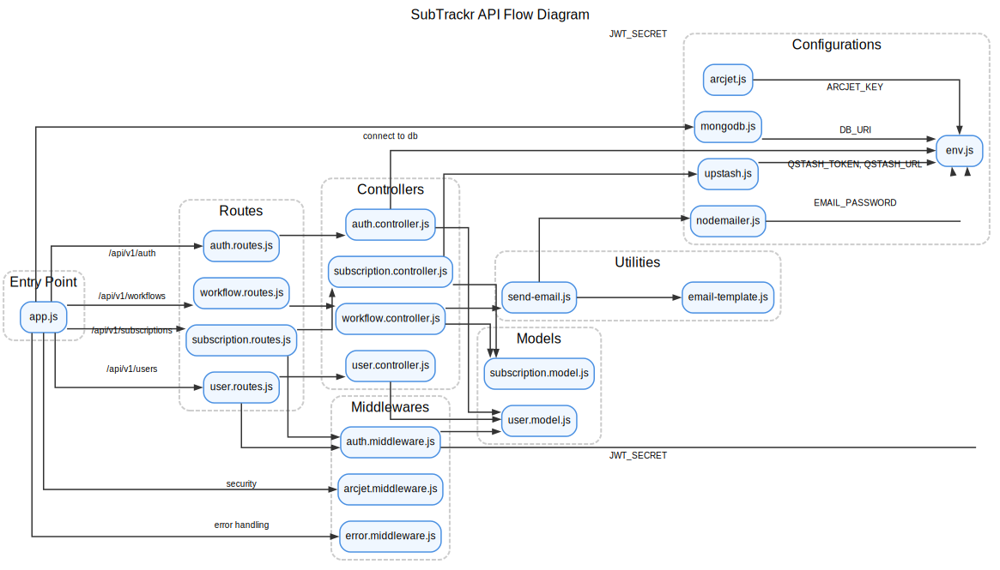

# SubTrackr API

SubTrackr is a robust and scalable backend API for a subscription tracking application. It allows users to manage their subscriptions and receive timely reminders for renewals. This project is built with a modern, production-ready technology stack and follows best practices in API development, security, and application architecture.


<p align="center">
  
  <br/>
  <em>A high-level overview of the <strong>SubTrackr API</strong> architecture, detailing the request lifecycle, modular component structure, and integration with external services for security, database, and automated workflows.</em>
</p>

-----

## ✨ Features

  * **User Authentication**: Secure user registration and login with JWT-based authentication.
  * **Password Encryption**: Passwords are securely hashed using `bcryptjs` before being stored in the database.
  * **Subscription Management**: Users can create and view their subscriptions.
  * **Automated Renewal Reminders**: The application uses **Upstash Workflow** to schedule and send email reminders for upcoming subscription renewals at 7, 5, 2, and 1 day(s) before the renewal date.
  * **Email Notifications**: Email reminders are sent using **Nodemailer** with customizable HTML templates.
  * **Security**:
      * **Rate Limiting**: Implements a token bucket algorithm to limit requests to 5 per 10 seconds, with a bucket capacity of 10.
      * **Bot Detection**: Protects against malicious bots while allowing search engine crawlers.
  * **Robust Error Handling**: A centralized error handling middleware is in place to manage application-wide errors gracefully.
  * **Scalable Architecture**: The project follows a clean, modular architecture with a clear separation of concerns (routes, controllers, models, middlewares), making it easy to maintain and scale.

-----

## 🚀 Tech Stack

  * **Backend**: Node.js, Express.js
  * **Database**: MongoDB with Mongoose ODM
  * **Authentication**: JSON Web Tokens (JWT)
  * **Password Hashing**: bcrypt.js
  * **Real-time & Scheduled Tasks**: Upstash Workflow
  * **Security**: Arcjet (Rate Limiting & Bot Detection)
  * **Emailing**: Nodemailer
  * **Environment Management**: dotenv
  * **Linting**: ESLint

-----

## ⚙️ Getting Started

### Prerequisites

  * Node.js (v16.x or higher)
  * npm
  * MongoDB
  * An SMTP server for sending emails (e.g., Gmail)
  * Arcjet account
  * Upstash account

### Installation & Setup

1.  **Clone the repository:**

    ```bash
    git clone https://github.com/akshaytiwari27/subtrackr-api.git
    cd subtrackr-api
    ```

2.  **Install dependencies:**

    ```bash
    npm install
    ```

3.  **Set up environment variables:**
    Create a `.env.development.local` file in the root directory and add the following environment variables:

    ```env
    # Application
    PORT=3000
    NODE_ENV=development
    SERVER_URL=http://localhost:3000

    # Database
    DB_URI=<YOUR_MONGODB_CONNECTION_STRING>

    # JWT
    JWT_SECRET=<YOUR_JWT_SECRET>
    JWT_EXPIRES_IN=1d

    # Arcjet
    ARCJET_KEY=<YOUR_ARCJET_SITE_KEY>

    # Upstash
    QSTASH_TOKEN=<YOUR_QSTASH_TOKEN>
    QSTASH_URL=<YOUR_QSTASH_URL>

    # Nodemailer
    EMAIL_PASSWORD=<YOUR_EMAIL_APP_PASSWORD>
    ```

4.  **Start the development server:**

    ```bash
    npm run dev
    ```

    The API will be running at `http://localhost:3000`.

-----

## 🔀 API Endpoints

### Authentication

  * `POST /api/v1/auth/sign-up` - Register a new user
  * `POST /api/v1/auth/sign-in` - Log in a user

### Users

  * `GET /api/v1/users` - Get all users
  * `GET /api/v1/users/:id` - Get a specific user (requires authentication)

### Subscriptions

  * `POST /api/v1/subscriptions` - Create a new subscription (requires authentication)
  * `GET /api/v1/subscriptions/user/:id` - Get all subscriptions for a specific user (requires authentication)

### Workflows

  * `POST /api/v1/workflows/subscription/reminder` - Webhook to trigger subscription reminders

-----

## 📂 Project Structure

```
subtrackr-api/
├── config/
│   ├── arcjet.js
│   ├── env.js
│   ├── nodemailer.js
│   └── upstash.js
├── controllers/
│   ├── auth.controller.js
│   ├── subscription.controller.js
│   ├── user.controller.js
│   └── workflow.controller.js
├── database/
│   └── mongodb.js
├── middlewares/
│   ├── arcjet.middleware.js
│   ├── auth.middleware.js
│   └── error.middleware.js
├── models/
│   ├── subscription.model.js
│   └── user.model.js
├── routes/
│   ├── auth.routes.js
│   ├── subscription.routes.js
│   ├── user.routes.js
│   └── workflow.routes.js
├── utils/
│   ├── email-template.js
│   └── send-email.js
├── .env.development.local
├── .gitignore
├── app.js
├── eslint.config.js
├── package.json
└── README.md
```

-----

## 🔮 Future Improvements

  * **Subscription Updates & Cancellation**: Implement endpoints for updating and canceling subscriptions.
  * **Payment Integration**: Integrate with a payment gateway like Stripe to handle subscription payments.
  * **OAuth 2.0**: Add social login options (Google, GitHub, etc.).
  * **Testing**: Write unit and integration tests using a framework like Jest or Mocha.
  * **API Documentation**: Generate and host comprehensive API documentation using tools like Swagger or Postman.
  * **Containerization**: Dockerize the application for easier deployment and scalability.
